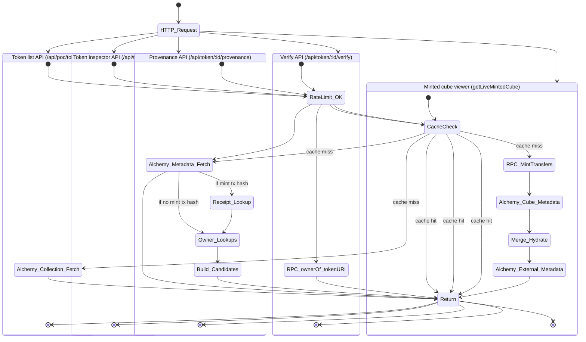

# Blockchain Interaction State Machine

This diagram summarizes the state flow for on-chain and Alchemy-backed reads used by
the landing site and token inspector.

Sources:
- Token list + Alchemy collection fetch: `app/api/poc/tokens/route.ts`, `app/_lib/alchemy.ts`
- Token inspector metadata: `app/api/token/[id]/route.ts`, `app/_lib/alchemy.ts`
- Provenance (receipt parsing + owners lookup): `app/api/token/[id]/provenance/route.ts`, `app/_lib/ethers.ts`, `app/_lib/alchemy.ts`
- Verify (ownerOf/tokenURI): `app/api/token/[id]/verify/route.ts`, `app/_lib/ethers.ts`
- Minted cube viewer (mint transfers + metadata + external metadata): `app/_lib/mintedCubeService.ts`
